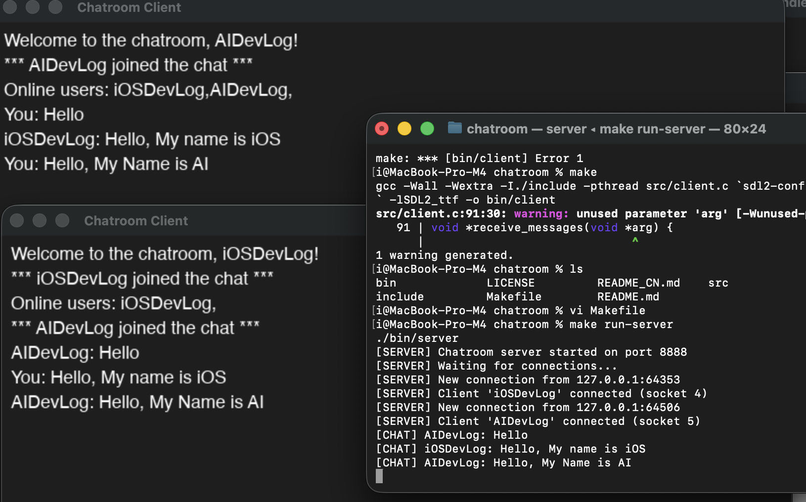

# 💬 Chatroom Application with SDL

[中文](README_CN.md)

A lightweight, real-time multi-client chatroom application built with C, SDL2, and socket programming. Features a multi-threaded TCP server and a beautiful graphical client interface.



## ✨ Features

- 🌐 Multi-client support (up to 10 concurrent users)
- ⚡ Real-time message broadcasting
- 🎨 Modern graphical user interface using SDL2
- 📢 User join/leave notifications
- 👥 Online user list
- 🎯 Simple and clean dark theme design
- 🔄 Multi-threaded server architecture
- 💻 Cross-platform compatibility (macOS, Linux)

## 🏗️ Architecture

- **Server**: Multi-threaded TCP server handling client connections with pthread
- **Client**: SDL2-based GUI with real-time network communication
- **Protocol**: Custom message-based protocol with type differentiation (JOIN, LEAVE, TEXT, USER_LIST)
- **Communication**: TCP sockets for reliable message delivery

## 📋 Prerequisites

### macOS
```bash
brew install sdl2 sdl2_ttf
```

### Ubuntu/Debian
```bash
sudo apt-get install libsdl2-dev libsdl2-ttf-dev
```

### Fedora
```bash
sudo dnf install SDL2-devel SDL2_ttf-devel
```

## 🔨 Building

Build both server and client:
```bash
make
```

Build only the server:
```bash
make server
```

Build only the client:
```bash
make client
```

Clean build files:
```bash
make clean
```

## 🚀 Running

### Start the Server

In one terminal:
```bash
./bin/server
```

The server will start listening on port 8888.

### Start Client(s)

In another terminal (or multiple terminals for multiple clients):
```bash
./bin/client <username> <server_ip>
```

Example:
```bash
./bin/client Alice 127.0.0.1
./bin/client Bob 127.0.0.1
./bin/client Charlie 127.0.0.1
```

## 📖 Usage

1. **Start the server first** - Run the server binary to begin accepting connections
2. **Launch one or more clients** - Each client needs a unique username
3. **Type messages** - Use the input box at the bottom of the client window
4. **Press Enter to send** - Messages are broadcast to all connected clients in real-time
5. **Close window to disconnect** - The server will notify other users when you leave

## 📁 Project Structure

```
chatroom/
├── include/
│   └── common.h          # Common definitions and message structures
├── src/
│   ├── server.c          # Server implementation
│   └── client.c          # Client implementation with SDL GUI
├── bin/                  # Compiled binaries (created after build)
│   ├── server
│   └── client
├── Makefile              # Build configuration
└── README.md             # This file
```

## 🔧 Network Protocol

The application uses a simple message structure:

```c
typedef struct {
    int type;                    // Message type (JOIN, LEAVE, TEXT, USER_LIST)
    char username[32];           // Sender's username
    char content[1024];          // Message content
} Message;
```

Message types:
- `MSG_JOIN (1)`: User joined the chatroom
- `MSG_LEAVE (2)`: User left the chatroom
- `MSG_TEXT (3)`: Regular text message
- `MSG_USER_LIST (4)`: List of online users

## ⚙️ Configuration

You can modify these constants in `include/common.h`:

- `PORT`: Server port (default: 8888)
- `MAX_CLIENTS`: Maximum concurrent clients (default: 10)
- `BUFFER_SIZE`: Message buffer size (default: 1024)
- `USERNAME_SIZE`: Maximum username length (default: 32)

Window dimensions can be changed in `src/client.c`:
- `WINDOW_WIDTH`: Client window width (default: 800)
- `WINDOW_HEIGHT`: Client window height (default: 600)

## 🔍 Troubleshooting

### Font Loading Error
If you get a font loading error, the client tries these paths:
- macOS: `/System/Library/Fonts/Helvetica.ttc`
- Linux: `/usr/share/fonts/truetype/dejavu/DejaVuSans.ttf`

You can modify the font path in `src/client.c` line 258 to match your system's font location.

### Port Already in Use
If you get "Address already in use" error, either:
- Wait a few seconds for the OS to release the port
- Change the PORT constant in `include/common.h`

### Connection Refused
Make sure:
- The server is running before starting clients
- You're using the correct server IP address
- Firewall isn't blocking the port

## ⚠️ Limitations

- ❌ No message history persistence
- ❌ No encryption (messages sent in plain text)
- ❌ No authentication
- ❌ Maximum message length: 1024 bytes
- ❌ Maximum username length: 32 characters
- ❌ Maximum concurrent clients: 10

## 🚀 Future Enhancements

- 🔒 Message encryption (TLS/SSL)
- 🔐 User authentication
- 💾 Message history and persistence
- 📎 File sharing capabilities
- 💬 Private messaging between users
- 😀 Emoji support
- ⚡ Better error handling and recovery
- ⚙️ Configurable settings via command line or config file
- 🎨 Customizable themes and colors
- 🔔 Sound notifications
- 📊 User status indicators (typing, online, away)

## 📄 License

See LICENSE file for details.

## 🤝 Contributing

Contributions are welcome! Please feel free to submit a Pull Request.

## 📝 Technical Details

### Server Implementation (src/server.c)
- Uses `pthread` for multi-threaded client handling
- Each client connection runs in a separate thread
- Thread-safe client list management with mutex locks
- Supports up to 10 concurrent connections
- Broadcasts messages to all connected clients except the sender

### Client Implementation (src/client.c)
- SDL2 for window management and rendering
- SDL2_ttf for text rendering
- Separate thread for receiving messages from server
- Real-time UI updates at ~60 FPS
- Simple input handling with backspace support

### Communication Flow
1. Client connects to server
2. Client sends JOIN message with username
3. Server broadcasts JOIN notification to all clients
4. Server sends current user list to new client
5. Clients exchange TEXT messages through server
6. Server broadcasts all messages to connected clients
7. On disconnect, server sends LEAVE notification

## 🎯 Use Cases

- Learning socket programming in C
- Understanding multi-threaded server architecture
- Exploring SDL2 GUI development
- Building real-time communication systems
- Educational projects for networking courses

## 💡 Tips

- Use different terminal windows to test multiple clients
- Check server console output for connection logs
- Network traffic on port 8888 must be allowed
- For remote connections, use server's actual IP instead of 127.0.0.1
- Username is set at client startup and cannot be changed during session

---

**Built with ❤️ using C, SDL2, and socket programming**
