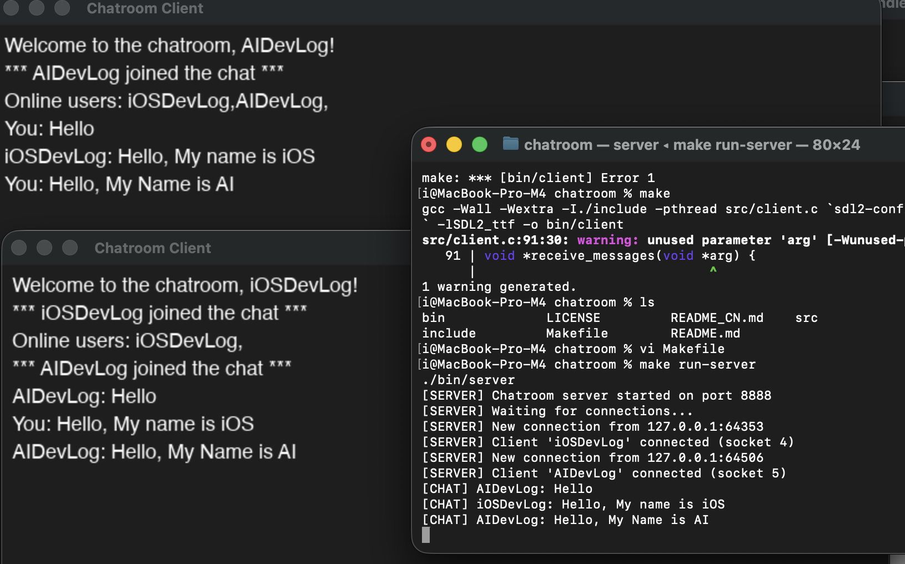

# 💬 基于 SDL 的聊天室应用程序

一个轻量级的实时多客户端聊天室应用程序，使用 C 语言、SDL2 和套接字编程构建。具有多线程 TCP 服务器和精美的图形客户端界面。



## ✨ 功能特性

- 🌐 多客户端支持（最多 10 个并发用户）
- ⚡ 实时消息广播
- 🎨 现代化的 SDL2 图形用户界面
- 📢 用户加入/离开通知
- 👥 在线用户列表
- 🎯 简洁优雅的深色主题设计
- 🔄 多线程服务器架构
- 💻 跨平台兼容（macOS、Linux）

## 🏗️ 系统架构

- **服务器**：使用 pthread 的多线程 TCP 服务器，处理客户端连接
- **客户端**：基于 SDL2 的图形界面，支持实时网络通信
- **协议**：自定义消息协议，支持多种消息类型（加入、离开、文本、用户列表）
- **通信方式**：TCP 套接字，确保消息可靠传输

## 📋 环境要求

### macOS
```bash
brew install sdl2 sdl2_ttf
```

### Ubuntu/Debian
```bash
sudo apt-get install libsdl2-dev libsdl2-ttf-dev
```

### Fedora
```bash
sudo dnf install SDL2-devel SDL2_ttf-devel
```

## 🔨 编译构建

构建服务器和客户端：
```bash
make
```

仅构建服务器：
```bash
make server
```

仅构建客户端：
```bash
make client
```

清理构建文件：
```bash
make clean
```

## 🚀 运行程序

### 启动服务器

在一个终端中：
```bash
./bin/server
```

服务器将开始在 8888 端口监听。

### 启动客户端（多个）

在另一个终端（或多个终端以启动多个客户端）：
```bash
./bin/client <用户名> <服务器 IP>
```

示例：
```bash
./bin/client Alice 127.0.0.1
./bin/client Bob 127.0.0.1
./bin/client Charlie 127.0.0.1
```

## 📖 使用说明

1. **首先启动服务器** - 运行服务器程序开始接受连接
2. **启动一个或多个客户端** - 每个客户端需要唯一的用户名
3. **输入消息** - 在客户端窗口底部的输入框中输入
4. **按回车发送** - 消息会实时广播到所有已连接的客户端
5. **关闭窗口断开连接** - 服务器会通知其他用户您已离开

## 📁 项目结构

```
chatroom/
├── include/
│   └── common.h          # 通用定义和消息结构
├── src/
│   ├── server.c          # 服务器实现
│   └── client.c          # 带有 SDL 图形界面的客户端实现
├── bin/                  # 编译后的二进制文件（构建后生成）
│   ├── server
│   └── client
├── Makefile              # 构建配置
└── README.md             # 本文件
```

## 🔧 网络协议

应用程序使用简单的消息结构：

```c
typedef struct {
    int type;                    // 消息类型（加入、离开、文本、用户列表）
    char username[32];           // 发送者的用户名
    char content[1024];          // 消息内容
} Message;
```

消息类型：
- `MSG_JOIN (1)`：用户加入聊天室
- `MSG_LEAVE (2)`：用户离开聊天室
- `MSG_TEXT (3)`：常规文本消息
- `MSG_USER_LIST (4)`：在线用户列表

## 配置

您可以在 `include/common.h` 中修改这些常量：

- `PORT`：服务器端口（默认：8888）
- `MAX_CLIENTS`：最大并发客户端数（默认：10）
- `BUFFER_SIZE`：消息缓冲区大小（默认：1024）
- `USERNAME_SIZE`：用户名最大长度（默认：32）

窗口尺寸可以在 `src/client.c` 中更改：
- `WINDOW_WIDTH`：客户端窗口宽度（默认：800）
- `WINDOW_HEIGHT`：客户端窗口高度（默认：600）

## 故障排除

### 字体加载错误
如果出现字体加载错误，客户端会尝试以下路径：
- macOS：`/System/Library/Fonts/Helvetica.ttc`
- Linux：`/usr/share/fonts/truetype/dejavu/DejaVuSans.ttf`

您可以修改 `src/client.c` 第 258 行的字体路径，以匹配您系统的字体位置。

### 端口已被使用
如果出现“地址已在使用中”错误，您可以：
- 等待几秒钟，让操作系统释放端口
- 在 `include/common.h` 中更改 PORT 常量

### 连接被拒绝
请确保：
- 启动客户端前服务器正在运行
- 您使用的是正确的服务器 IP 地址
- 防火墙没有阻止端口

## 局限性

- 没有消息历史记录持久化
- 没有加密（消息以明文发送）
- 没有身份验证
- 最大消息长度：1024 字节
- 最大用户名长度：32 个字符
- 最大并发客户端数：10 个

## 未来改进

- 消息加密（TLS/SSL）
- 用户身份验证
- 消息历史记录
- 文件共享
- 私人消息
- 表情符号支持
- 更好的错误处理
- 通过命令行或配置文件进行可配置设置

## 许可证

详情请参见 LICENSE 文件。
